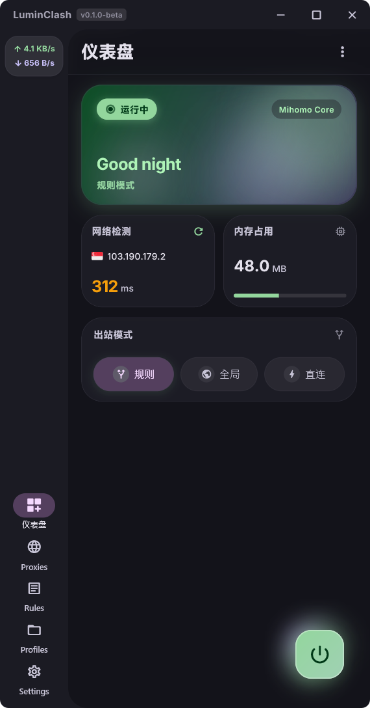
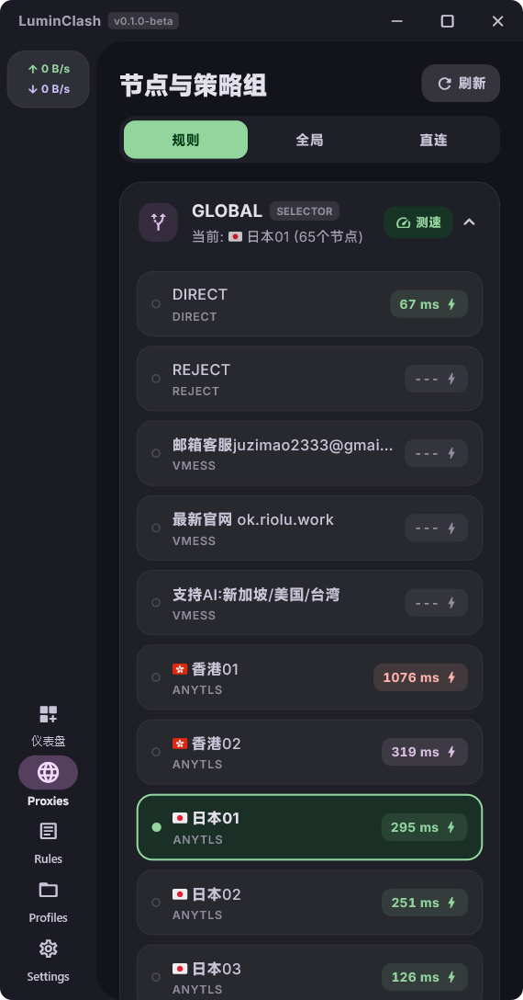
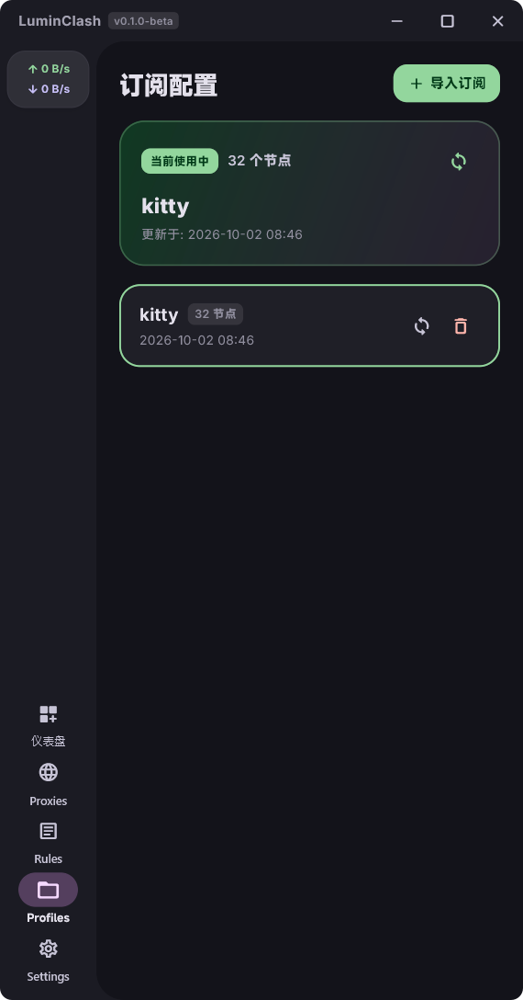

# LuminClash

一款基于 **Flutter** 与 **Mihomo (Clash.Meta)** 内核打造的跨平台代理客户端，采用 **Material You** 设计。

---

## 📸 核心设计特性

- 🎨 **灵动配色**：使用 Monet 取色，打造美观、灵动的视觉效果。
- 📱 **舒适交互**：遵循 MD3 规范，布局直观清晰，单手操作自然顺手。
- ⚡ **丝滑动效**：原生 M3 控件，动效丝滑流畅，移动端还有神秘的触感反馈。
- 💻 **多平台支持**：目前已测试支持 Windows，后续开发增加更多平台适配。

---
## 🖼️ 应用内截图

| 仪表盘 (Dashboard) | 节点与策略组 (Proxies) | 订阅管理 (Profiles) |
| :---: | :---: | :---: |
| [](Screenshots/WinDashboard.png) | [](Screenshots/WinProxies.png) | [](Screenshots/WinProfiles.png) |

---

## 🛠️ 构建与运行指南

### 0. 准备预编译 Mihomo 内核
内核依赖 [LuminClashCore](https://github.com/XSong1205/LuminClashCore)（来自 [MetaCubeX/mihomo](https://github.com/MetaCubeX/mihomo)）。
本地构建前，运行内置拉取脚本拉取内核：
```powershell
# 拉取内核
.\scripts\fetch_core.ps1

# 仅拉取 Windows 内核
.\scripts\fetch_core.ps1 -Target windows
```

### 1. Windows 桌面端
```powershell
# 热重载
flutter run -d windows

# 构建 Release
flutter build windows
# 生成文件位于: build\windows\x64\runner\Release\lumin_clash.exe
```

### 2. Android 移动端
```bash
# 构建 Release (拆分ABI)
flutter build apk --release --split-per-abi
# 生成文件位于: build/app/outputs/flutter-apk/app-*-release.apk
```

---
